#  Lab 02: Static Routing Across Multi-hop VyOS Routers

##  Objective  
Configure static routing across three VyOS routers connected in series (R1 → R3 → R2) to enable communication between R1 and R2 through an intermediate router (R3).  
This lab demonstrates:

- Point-to-point IP addressing
- Static routing logic across multiple hops
- End-to-end and link-by-link connectivity testing

---

##  Lab Topology

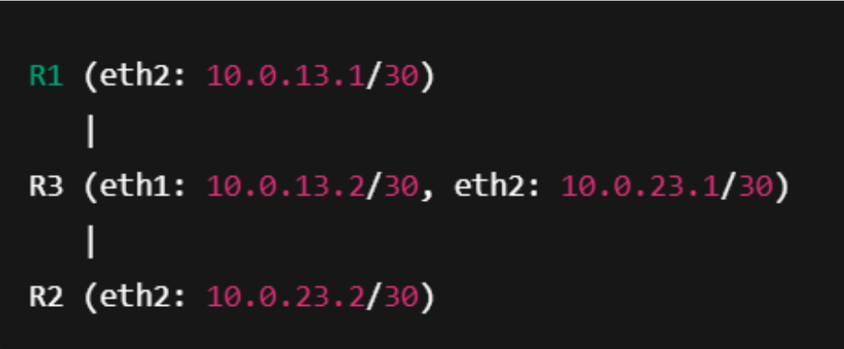

- All router-to-router links use `/30` subnets for efficient IP usage
- Interfaces mapped as follows:  
  - R1 eth2 → R3 eth1  
  - R3 eth2 → R2 eth2

---

##  Lab Steps

### 1️⃣ GNS3 Project Setup

- Created new GNS3 project with 3 VyOS routers
- Each router configured with 4 adapters for future flexibility
- Interfaces connected as:
  - R1 eth2 ↔ R3 eth1
  - R3 eth2 ↔ R2 eth2

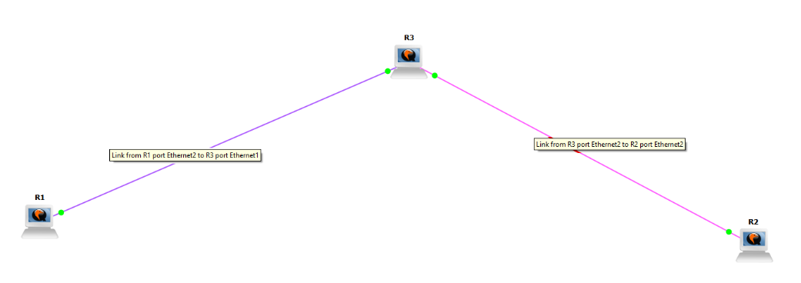

💬 This screenshot shows the initial GNS3 setup, including R1, R3, and R2, with the correct interface connections: R1 eth2 → R3 eth1 and R3 eth2 → R2 eth2. The interface labels are visible to clearly identify which interfaces are linked.

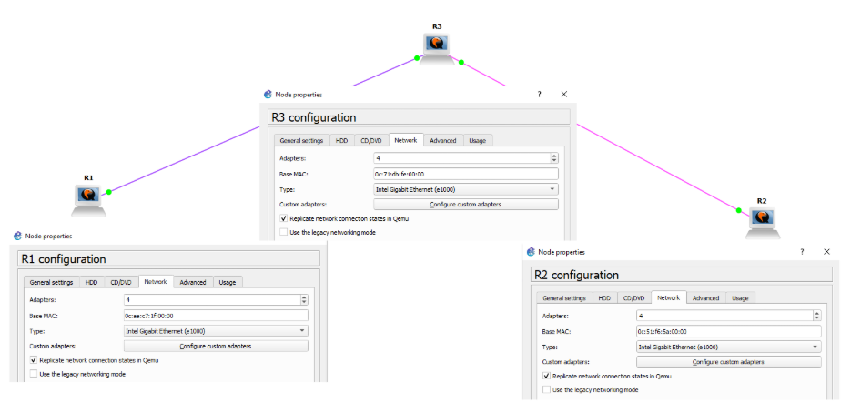

💬 Here we see each VyOS router configured with 4 network adapters, allowing flexibility for adding links and interfaces in future labs.

---

### 2️⃣ IP Address Configuration

#### 💻 R1

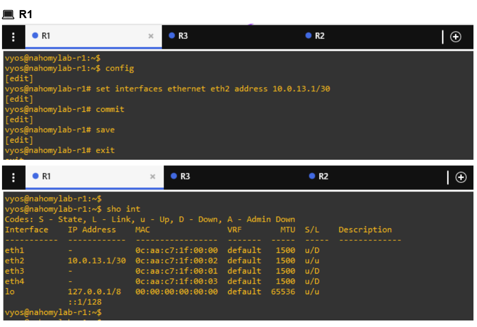

💬 R1 has `eth2` configured with `10.0.13.1/30`, link state is up/up, indicating the interface is active and connected.

--

#### 💻 R3

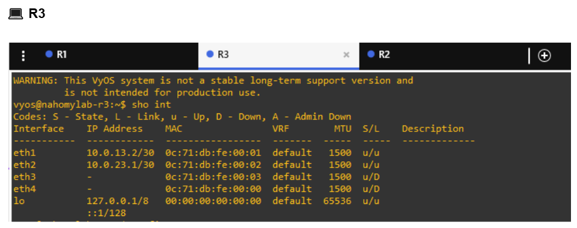

- `eth1` → `10.0.13.2/30`
- `eth2` → `10.0.23.1/30`

💬 R3 shows eth1 with 10.0.13.2/30 and eth2 with 10.0.23.1/30, both interfaces up and linked to neighbors.

--

#### 💻 R2

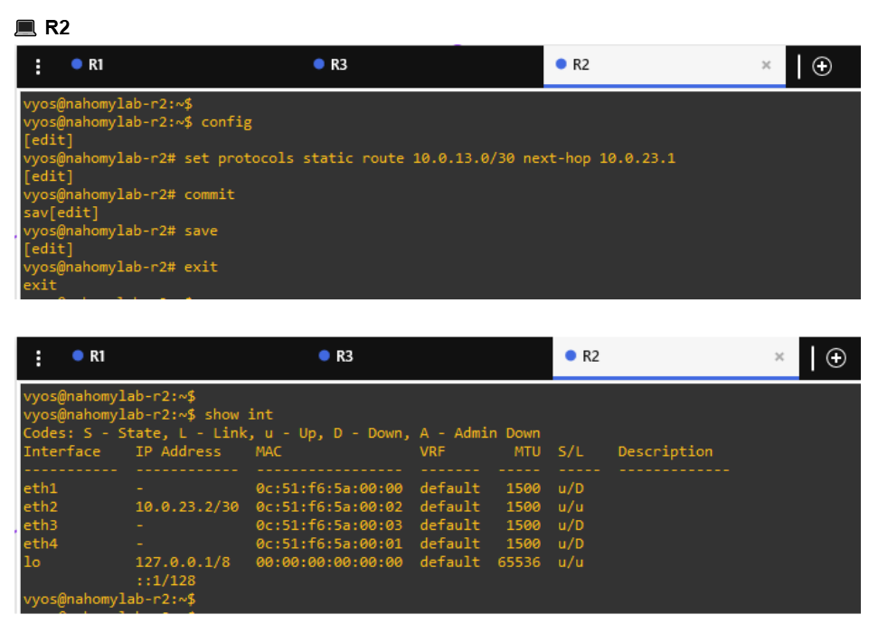

💬 R2 has `eth2` configured with `10.0.23.2/30`, link state is up/up, successfully linked to R3.

---

### 3️⃣ Verifying Direct Connectivity

#### 💻 R1 → R3

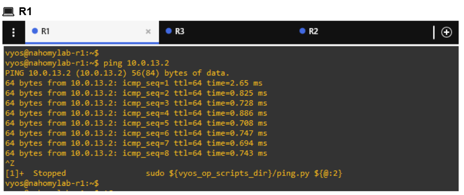

💬 Ping from R1 (`10.0.13.1`) to R3 (`10.0.13.2`) confirms direct connectivity on the first point-to-point link.

#### 💻 R3 → R1 & R2

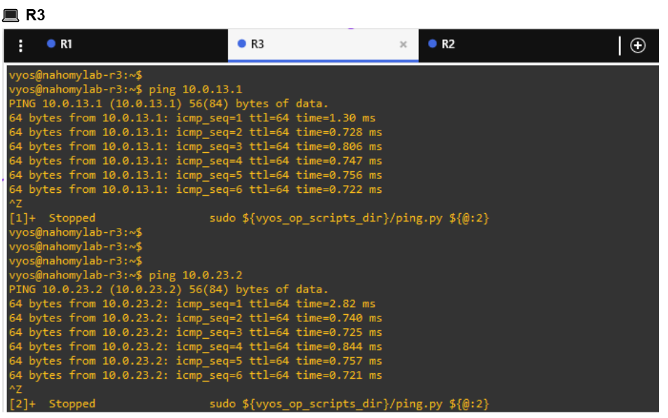

💬 Ping from R3 confirms bidirectional reachability to R1 on the `10.0.13.0/30` link and successful reachability to R2’s `10.0.23.2/30` address, verifying both point-to-point links are operational.

--

#### 💻 R2 → R3

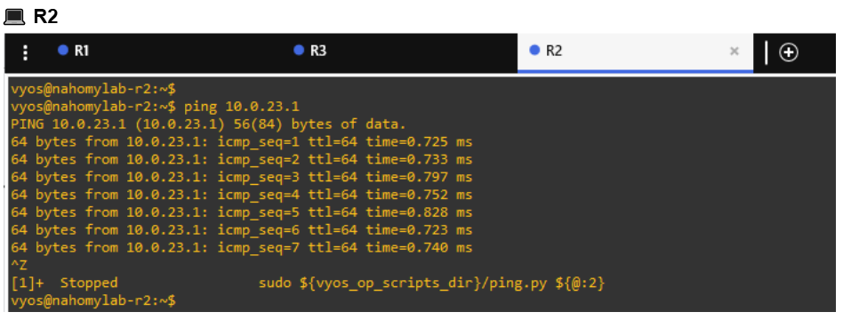

💬 Ping to `10.0.23.1` confirms second point-to-point link is functional.

---

### 4️⃣ Static Route Configuration

#### 💻 R1

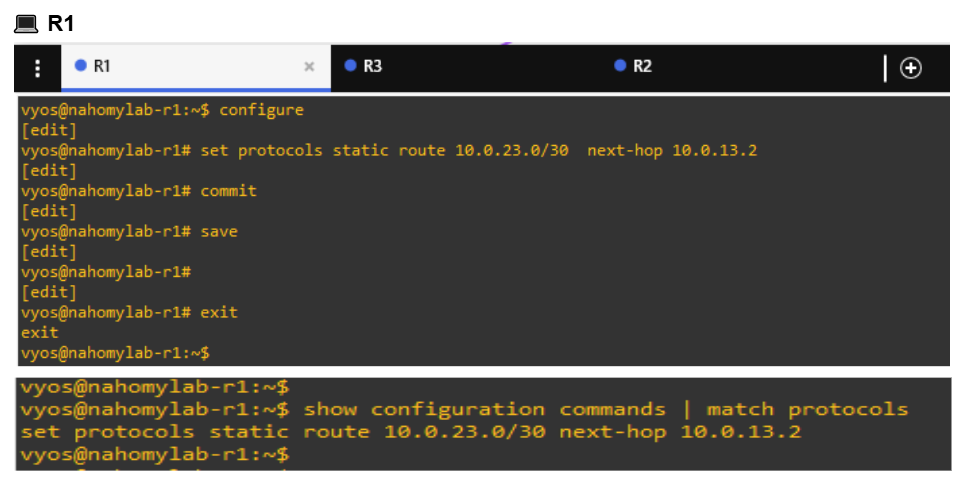

💬 R1 configured with a static route to the `10.0.23.0/30` network via R3’s `10.0.13.2`. This allows R1 to reach R2’s subnet through R3.

#### 💻 R2

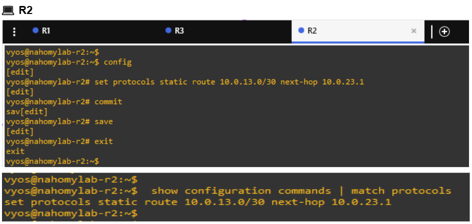

💬 R2 configured with a static route to the `10.0.13.0/30` network via R3’s `10.0.23.1`, enabling reachability to R1 via R3.

---

### 5️⃣ Verify End-to-End Connectivity

#### 💻 R1 → R2

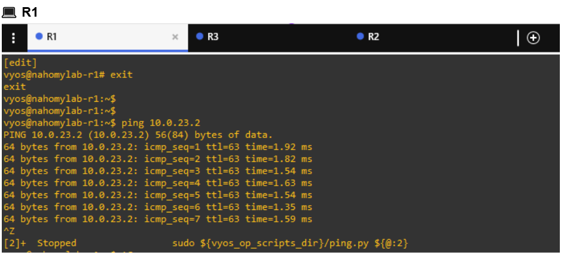

💬 R1 successfully pings R2’s `10.0.23.2` address. This confirms that static routing is correctly forwarding packets across R3.

#### 💻 R2 → R1

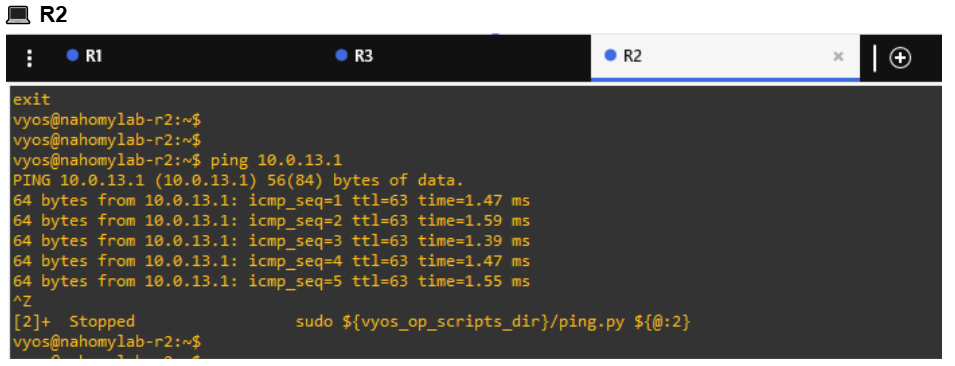

💬 R2 successfully pings R1’s 10.0.13.1 address, verifying bidirectional communication through the intermediate router.

---

###  Summary

This section of the lab demonstrated:

  - Setting up /30 subnets for efficient point-to-point router links

  - Using static routes to enable communication across an intermediate router

  - Testing each path with ping to confirm route correctness

  - Establishing a solid foundation for multi-hop network routing

---

###  Concepts Reinforced

  - Point-to-point subnet design: /30 subnetting reduces IP waste and simplifies routing

  - Static routing fundamentals: Manual route creation and path selection

  - Multi-hop troubleshooting: Step-by-step connectivity checks help isolate problems

  - GNS3 interface mapping: Correct virtual interface assignment is essential for clean topologies

---

###  Notes

  - Double-check GNS3 cabling and adapter mappings — mismatches lead to link-down issues

  - Always verify direct link connectivity with ping before configuring routes

  - Use visible interface labels on the GNS3 canvas to reduce mistakes

  - Save your config commands for reuse in larger topologies

---

###  Lab Status

#### ✅ Completed successfully — All routers achieved full end-to-end connectivity using static routes across R3.

