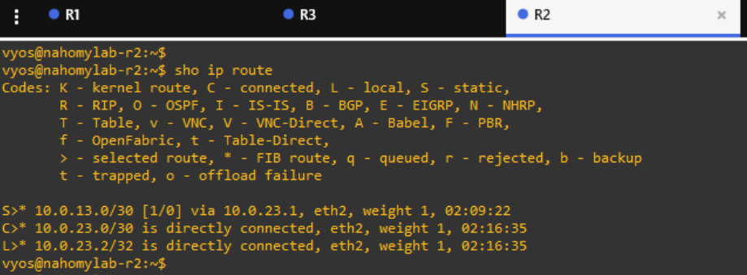

# 🚀 Lab 03: Static Routing Extension — Failure Simulation + Redundancy Concepts

## 📝 Lab Objective

This lab builds upon the static routing configuration completed in Lab 2. The goal is to simulate a link failure between routers and observe how static routes behave in the absence of dynamic failover. Additionally, this lab introduces basic redundancy concepts by planning alternative paths (even if not yet implemented) and reflecting on static routing limitations.

#### Through this lab I aim to:

  - Reinforce static route configuration and troubleshooting skills.

  - Simulate a failure in the R1-R3 or R3-R2 link and observe routing behavior.

  - Document how static routes handle (or fail to handle) link outages.

  - Discuss possible next steps, such as implementing dynamic routing protocols or designing redundant paths.

---

## 🌐 Topology

#### The topology remains the same as in Lab 2:

---

## 🌱 Lab Context

Lab 3 extends the configuration from Lab 2. The initial point-to-point addressing and static routes will remain in place. This lab focuses on failure handling and preparing for future dynamic routing enhancements.

---

## ⚡ Step 1: Confirm Baseline Working State

#### 💻 R1

💬 This screenshot shows R1 successfully pinging R2’s `10.0.23.2` address, confirming that static routing via R3 is working and end-to-end connectivity is intact prior to simulating any failure. The `show configuration commands | match protocols` output verifies that R1 has a static route for the `10.0.23.0/30` network, with R3’s `10.0.13.2` as the next-hop, enabling R1 to reach R2 through R3.

--

#### 💻 R2

💬 This screenshot shows R2 successfully pinging R1’s `10.0.13.1` address, verifying that the static route via R3 is working and two-way communication is established between R1 and R2 before simulating any failure. The `show configuration commands | match protocols` output confirms that R2 has a static route for the `10.0.13.0/30` network, pointing to R3’s `10.0.23.1` as the next-hop, enabling R2 to reach R1 through the intermediate router.

--

#### 💻 R3

💬 This snapshot displays R3’s routing table, showing directly connected routes for the `10.0.13.0/30` and `10.0.23.0/30` subnets. Since R3 is the transit router, no static routes are needed here; it forwards packets based on these direct connections.

---

## ⚡ Step 2: Simulate Link Failure

#### We want to simulate a failure on one of the point-to-point links and observe how static routing behaves when the path is broken.
I chose to simulate a failure between R1 and R3 by disabling R1’s eth2.

💬 This snapshot simulates the cable being unplugged between R1 and R3.

### 🔹 Verifying Impact

#### 💻 R1

💬 This shows that R1 can no longer reach R2 because the static route relies on the failed link to R3.

#### 💻 R2

💬 This confirms that R2 also loses connectivity to R1 because the path through R3 is broken.

#### 💻 R3

💬 R3’s routing table still shows its directly connected routes. Since static routes don’t update dynamically, no route changes occur.

#### 💻 R1 and R2 interfaces states

💬 R1’s eth2 shows A/D (Admin Down / Link Down), indicating that the interface was manually disabled as part of the failure simulation. This action cuts off the link between R1 and R3.

💬 R2’s eth1 remains up/up because, from its perspective, its own interface and NIC are still enabled and active — even though no traffic is being received from R1. This highlights a limitation in static routing combined with basic link status detection in virtual environments.

---

## ⚡ Step 3: Summarize and Plan for Resilience

### Lessons Learned:

- **Static Routing Limitation:** The lab demonstrated that static routes remain unchanged even when a link fails, resulting in a loss of connectivity. Without a dynamic protocol, the network can’t automatically reroute traffic when a path goes down.

- **Interface States and Connectivity:** Even if an interface shows as up/up, it doesn’t always mean end-to-end connectivity is intact. This highlights the need for more sophisticated monitoring and routing techniques.

- **Importance of Redundancy:** In a real-world network, redundancy is crucial. The lack of an alternate path means a single failure can disrupt connectivity. Dynamic routing protocols (like OSPF) can help by automatically finding new paths.

#### 💻 R2

💬 This output shows that R2 still has its static route for `10.0.13.0/30` pointing via `10.0.23.1` (R3) through eth2. Even after the simulated failure of the R1-R3 link, R2’s static route remains in place, illustrating that static routing does not automatically adapt or remove unreachable paths. The connected and local routes for the `10.0.23.0/30` subnet remain active because R2’s direct link to R3 is still physically intact.

#### 💻 R1

💬 This snapshot shows that R1’s routing table is empty after disabling eth2. The connected route for `10.0.13.0/30` and the static route for `10.0.23.0/30` are no longer active because they rely on the disabled interface. This highlights how static routing depends on the availability of its configured next-hop and associated interface.

--

💬 This confirms that the static route configuration still exists, even though it is not installed in the routing table due to the interface being disabled.

---

## ✅ Summary

In this lab, we extended our static routing setup from Lab 2 by simulating a link failure between R1 and R3. We observed how the network behaved without any dynamic failover mechanisms. Specifically, we:

- Disabled the interface on R1 that connected it to R3 (eth2).

- Verified that end-to-end connectivity between R1 and R2 was lost.

- Examined how static routes remained configured but became inactive when their associated next-hop or interface was unavailable.

- Identified that static routes do not adapt to link failures and do not provide automatic rerouting.

---

## 💡 Concepts Reinforced

  - Static routing limitations: Static routes remain unchanged during failures and do not provide automatic path recalculation or rerouting.

  - Routing table dynamics: Routes tied to disabled interfaces are removed from the active routing table even if they remain in the configuration.

  - Interface vs. path awareness: An interface may appear up (e.g., on R3 or R2) even if the end-to-end path is broken, reinforcing the need for deeper failure detection mechanisms.

  - The importance of dynamic routing protocols: This lab sets the stage for implementing dynamic routing (such as OSPF) to provide automatic failover and resiliency.

---

## 📝 Notes

- In this lab, link failure was simulated by administratively shutting down R1’s eth2 interface.

- R1’s routing table became empty because it had no active interfaces with valid routes.

- R2’s routing table still showed its static route, but no packets could successfully reach R1 because the path via R3 was broken.

- Static routing, while simple and deterministic, does not offer the flexibility needed for fault-tolerant network designs.

---

## 📌 Lab Status

#### ✅ Completed successfully — The failure scenario was implemented, observed, and documented.

---

### 🌱 Next step (Lab 4) — We will introduce OSPF as a dynamic routing protocol to provide automatic route recalculation in case of link failures. Lab 4 will build on this topology and demonstrate how dynamic routing protocols can create self-healing networks.

