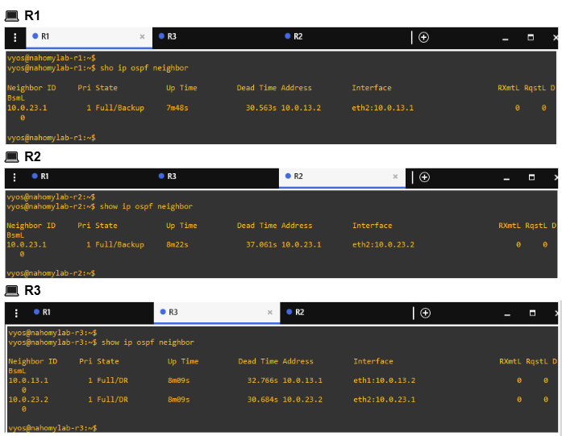
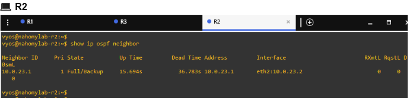

# 🧪 Lab 04: Implementing Dynamic Routing with OSPF

This lab enhances the static routing setup from Labs 2 and 3 by implementing **OSPF (Open Shortest Path First)**. The goal is to provide automatic route advertisement and dynamic failover in the event of a link failure.

By the end of this lab, **R1** and **R2** will dynamically learn routes through **R3**, and the network will adapt to link changes automatically — no manual reconfiguration needed.

## 📝 Lab Objective

- Replace static routing with dynamic OSPF routing
- Establish neighbor relationships and route exchange between R1, R2, and R3
- Simulate and observe OSPF convergence after link failure
- Restore connectivity and confirm network recovery

---

## 🔹 Step 1: Clean Up Static Routing and Confirm Baseline

On both R1 and R2, the following commands were executed to remove static routing:

```
configure
delete protocols static
commit
save
exit
```
After removal, the routing tables were verified on all three routers using: `show ip route`


💬 This snapshot confirms that R1’s static routes have been removed. Only directly connected and local routes remain, providing a clean baseline for OSPF.


💬 This snapshot shows that R2 is no longer using static routes. The routing table is limited to local and connected networks, as expected before dynamic routing is configured.


💬 R3’s table also reflects a baseline state with only connected and local routes, ready for dynamic OSPF configuration in upcoming steps.

---

## 🔹 Step 2: Configure OSPF on R1, R2, and R3


💬 These outputs confirm that OSPF has been configured on R1, R2, and R3. Each router advertises its directly connected /30 subnet(s) into OSPF Area 0. R3 participates in both the 10.0.13.0/30 and 10.0.23.0/30 networks, acting as the intermediate router that enables R1 and R2 to dynamically exchange routing information.

---

## 🔹 Step 3: Verify OSPF Neighbor Adjacencies and Learned Routes



💬 These outputs confirm that OSPF adjacencies have been successfully formed. R1 is now a neighbor to R3, and R2 is also a neighbor to R3. This means the OSPF process is correctly identifying and peering with directly connected routers.


💬 These outputs show that R1 and R2 have successfully learned remote routes via OSPF. For example, R1 has dynamically learned the 10.0.23.0/30 network through R3, and R2 has learned 10.0.13.0/30 through R3, proving that OSPF is enabling multi-hop communication without static routes

---

## 🔹 Step 4: Simulate a Link Failure and Observe OSPF Convergence


💬 This command simulates a link failure by administratively shutting down the interface between R3 and R2.


💬 This output confirms that the OSPF neighbor relationship between R3 and R2 has been lost as a result of the link failure.


💬 The routing tables on both R1 and R2 now lack the OSPF-learned route to the opposite router’s subnet. This confirms that OSPF has successfully reconverged and withdrawn the unreachable route following the link failure.


💬 This ping result confirms that end-to-end connectivity was lost following the link failure, demonstrating the role of OSPF in maintaining accurate routing based on network changes.

---

## 🔹 Step 5: Restore the Failed Link and Observe OSPF Recovery


💬 This output confirms that the previously disabled interface has been re-enabled, restoring the physical link between R3 and R2.



💬 The OSPF neighbor relationship with R3 has been re-established, indicating that the protocol detected the restored link and resumed adjacency.


💬 The OSPF-learned routes to the opposite subnets have returned, demonstrating that the network has reconverged after the link restoration.


💬 Successful ping tests confirm that full connectivity between R1 and R2 has been automatically restored through dynamic routing.

---

## ✅ Summary

This lab extended our previous static routing setup by implementing OSPF (Open Shortest Path First) across a 3-router topology. We configured dynamic routing to replace static routes, verified OSPF neighbor adjacencies, and tested network reconvergence after simulating a link failure between R3 and R2. The lab successfully demonstrated how OSPF can automatically adapt to network changes and maintain routing accuracy without manual intervention.


## 🧠 Concepts Reinforced

- OSPF Configuration Basics: Configuring OSPF using /30 point-to-point networks in area 0.

- Neighbor Adjacency: Understanding DR, BDR, and DROther roles via show ip ospf neighbor.

- OSPF Convergence: How OSPF detects and responds to topology changes.

- Routing Table Behavior: Monitoring how OSPF populates or withdraws routes from the RIB (`show ip route`).

- Troubleshooting OSPF: Identifying reasons for lost connectivity (e.g., misconfigurations, downed links, or missing advertisements).

---

## 🟢 Lab Status

### ✅ Completed Successfully
 R1 and R2 were able to dynamically learn and remove routes via R3 using OSPF. The network correctly responded to simulated failures by recalculating the topology and updating routing tables. All steps have been fully tested, documented with snapshots, and annotated with portfolio-grade comments.


