# Lab 05: Scaling with Multi-Area OSPF + Loopback Advertisement

This lab builds upon the dynamic routing setup from Lab 04 by introducing a multi-area OSPF topology and loopback interface advertisement to simulate a more scalable and hierarchical enterprise network design.

By placing R1 and R2 in Area 1, and R3 in both Area 0 and Area 1, this lab demonstrates how to:

  - Segment OSPF into areas for better scalability and control

  - Use loopbacks as stable, routable identifiers

  - Enable cross-area route exchange via an Area Border Router (ABR)

This setup mirrors real-world enterprise deployments where routing domains are structured for efficiency, reduced overhead, and optimized convergence behavior.

---

##  Learning Objectives

- Design a multi-area OSPF network using Areas 0 and 1

- Configure and advertise loopback interfaces in OSPF

- Understand the roles of intra-area and inter-area routes

- Observe how ABRs handle cross-area communication

- Validate learned routes and OSPF database updates

- Strengthen OSPF hierarchy and scalability concepts

---

##  Topology

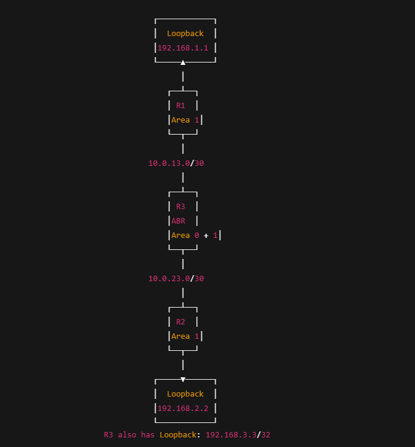 

---

###  Before beginning this lab, all previous OSPF configurations from earlier labs were removed on R1, R2, and R3 to ensure a clean starting point for the multi-area OSPF setup.

---

##  Step 1: Add Loopback Interfaces to All Routers

### 💻 R1

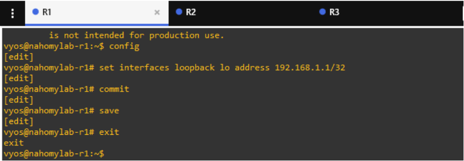 

💬 R1’s loopback interface lo was successfully configured with IP 192.168.1.1/32. This will later be advertised into OSPF Area 1.

### 💻 R2

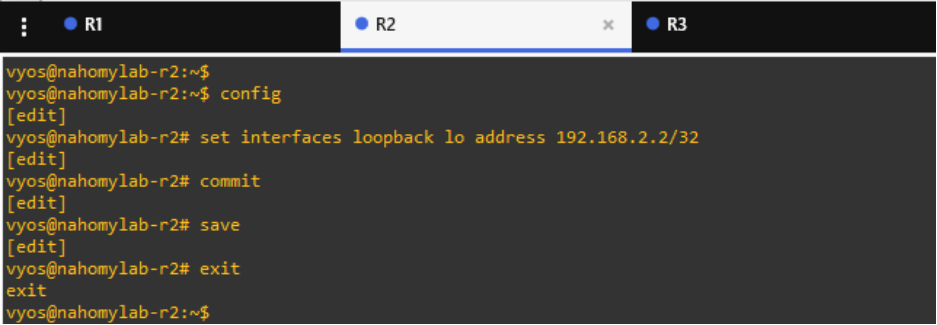 

💬 R2’s loopback interface lo is now configured with IP 192.168.2.2/32. This address will simulate a stable endpoint for dynamic routing.

### 💻 R3

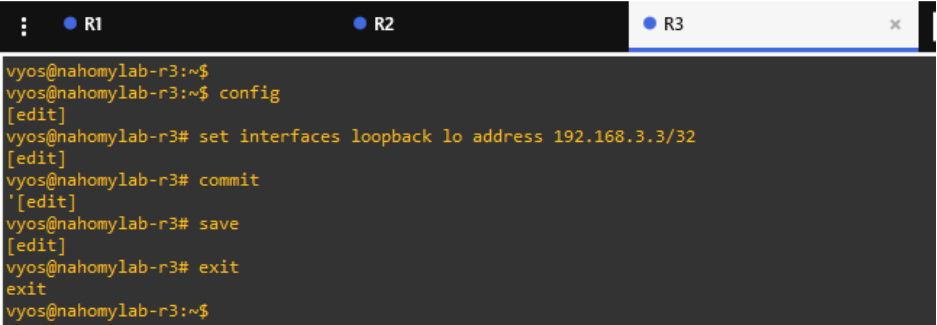 

💬 R3’s loopback interface has been assigned IP 192.168.3.3/32. R3 will serve as an ABR between Area 0 and Area 1.

---

##  Step 2: Configure Multi-Area OSPF and Advertise Loopbacks

### 💻 R1

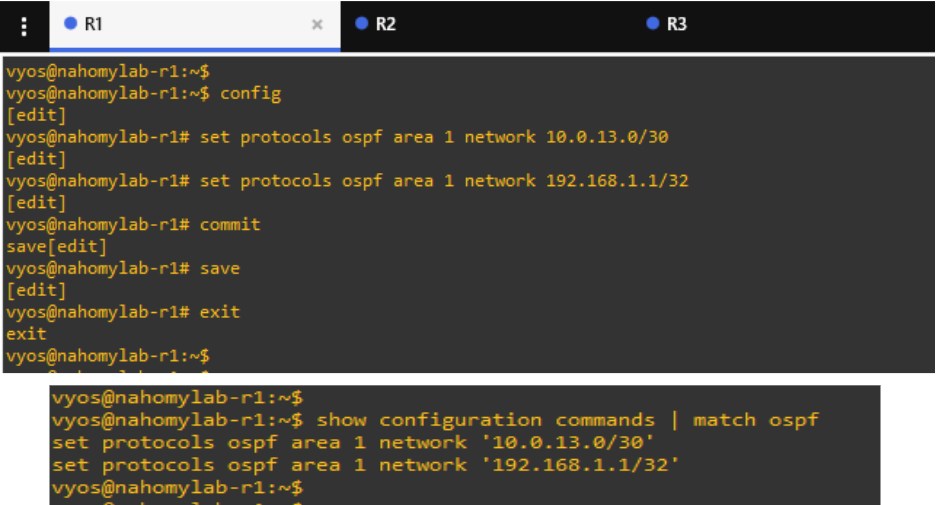  

💬 R1 advertises its loopback and the R1–R3 link into OSPF Area 1.

### 💻 R2

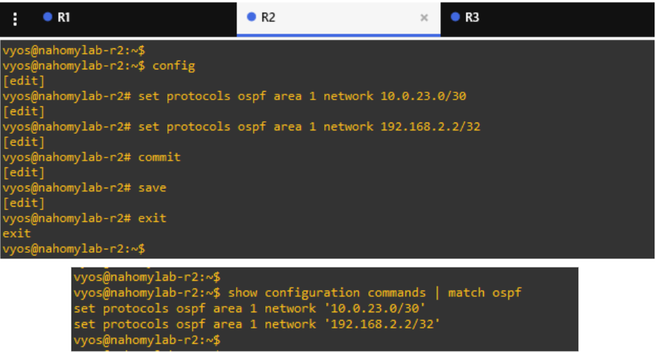 

💬 R2 advertises its loopback and the R2–R3 link into OSPF Area 1.

### 💻 R3

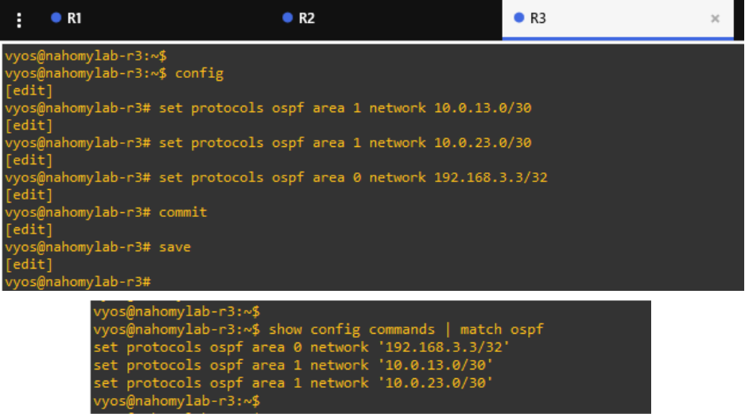 

💬 R3 connects both R1 and R2 through Area 1, and advertises its loopback via Area 0 — making it an Area Border Router (ABR).

---

##  Step 3: Verify OSPF Adjacencies and Loopback Reachability

###  Part 1: Verify OSPF Neighbors

### 💻 R1

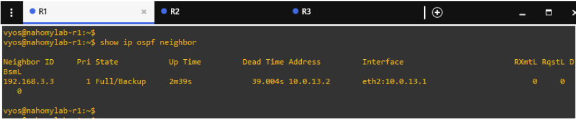 

💬 R1 has successfully formed a full OSPF neighbor relationship with R3 over the Area 1 point-to-point link.

### 💻 R2

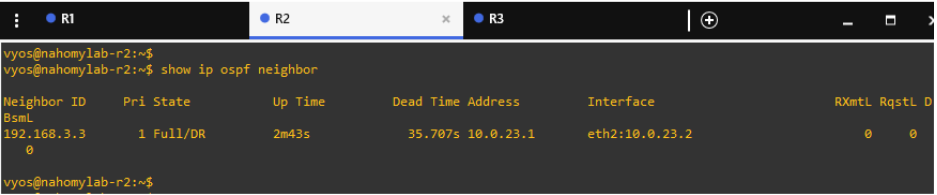 

💬 R2 shows a Full OSPF adjacency with R3 via the 10.0.23.0/30 link in Area 1.

### 💻 R3

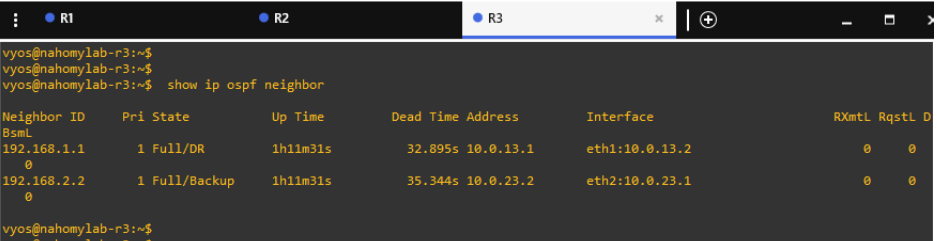 

💬 R3 has active OSPF neighbors with both R1 and R2, confirming its central role as the Area Border Router (ABR).

--

###  Part 2: Verify Routing Tables and Loopback Reachability

### 💻 R1

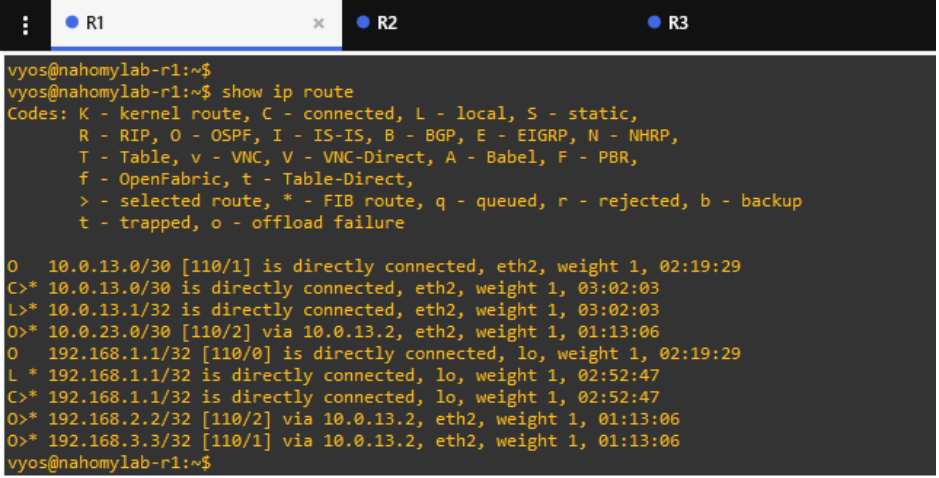 

💬 R1 dynamically learned R2’s and R3’s loopbacks via OSPF. The presence of inter-area routes (O IA) confirms multi-area propagation through the ABR.

### 💻 R2

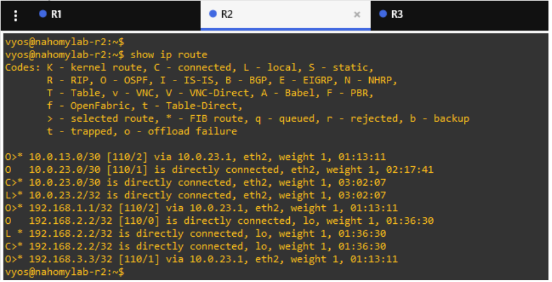 

💬 R2 successfully learned the loopbacks of R1 and R3, validating cross-area route learning through R3.

### 💻 R3

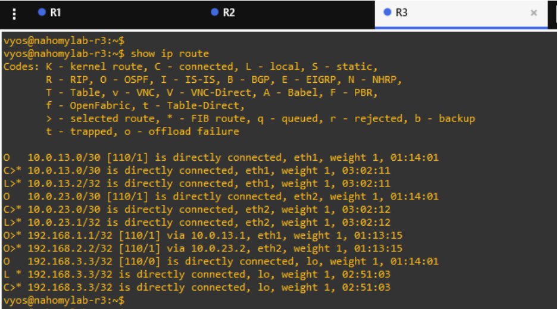 

💬 R3 has learned R1’s and R2’s loopbacks from Area 1 and can advertise them into Area 0 as an ABR.

--

###  Part 3: Ping Loopback Addresses

### 💻 R1

  

💬 R1 successfully pinged R2’s loopback (192.168.2.2) and R3’s loopback (192.168.3.3). These are learned via OSPF, confirming full end-to-end reachability through the ABR.

### 💻 R2

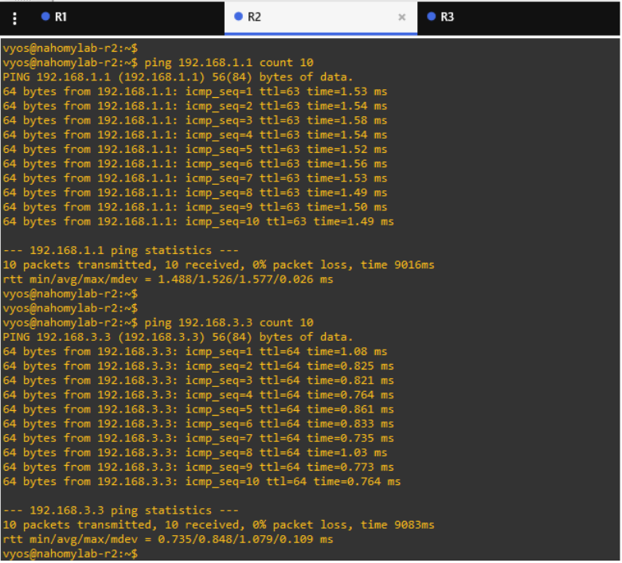  

💬 R2 successfully reached R1’s loopback (192.168.1.1) and R3’s loopback (192.168.3.3). These pings verify that inter-area OSPF route exchange is functioning correctly through R3.

----

##  Summary

In this lab, we extended dynamic routing by implementing multi-area OSPF across a 3-router topology. R3 was configured as an Area Border Router (ABR), connecting Area 0 and Area 1. Each router advertised its loopback interface, simulating internal host reachability across different OSPF areas. We verified neighbor adjacencies, confirmed OSPF-learned loopbacks, and successfully demonstrated full connectivity between all routers.

This lab emphasizes real-world design principles like hierarchical routing, loopback advertisement, and inter-area communication — essential for scalable enterprise networks and cloud migration readiness.

----

##  Concepts Reinforced

 - Multi-Area OSPF Design: Separation of areas to enhance scalability and reduce SPF overhead.

 - ABR Role: Understanding how R3 connects Area 0 and Area 1 and facilitates route redistribution.

 - Loopback Advertisement: Advertising /32 loopback interfaces to simulate internal host reachability.

 - OSPF Neighbor Formation: Verifying state transitions and full adjacency using show ip ospf neighbor.

 - Inter-Area Route Learning: Validating OSPF-learned routes and reachability between loopbacks.

 - Hierarchical Routing Principles: Realistic segmentation for performance, convergence, and maintainability.

---

##  Lab Status

### ✅ Completed Successfully

All routers formed OSPF adjacencies, advertised their loopbacks into the correct areas, and dynamically learned remote subnets. Ping tests confirmed inter-area communication and verified that the ABR (R3) is operating correctly. All configuration steps, outputs, and verifications were captured and documented with detailed snapshots and explanations.

