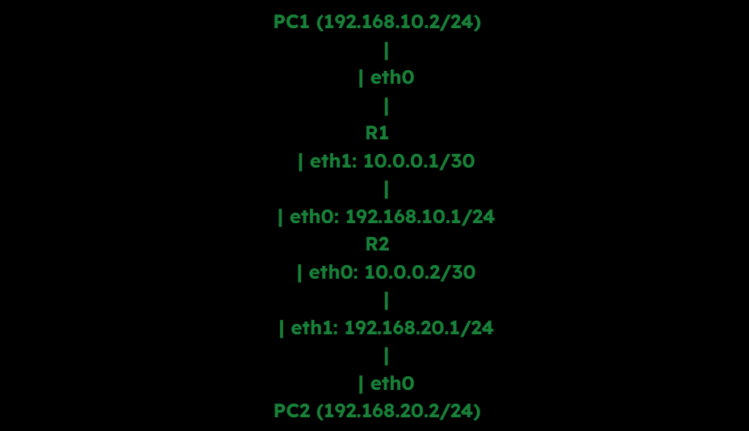
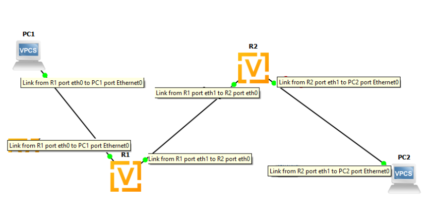
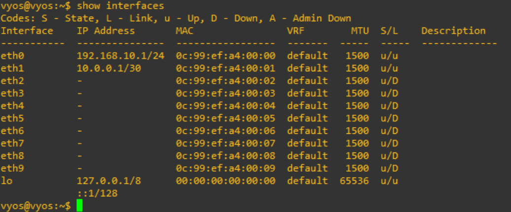
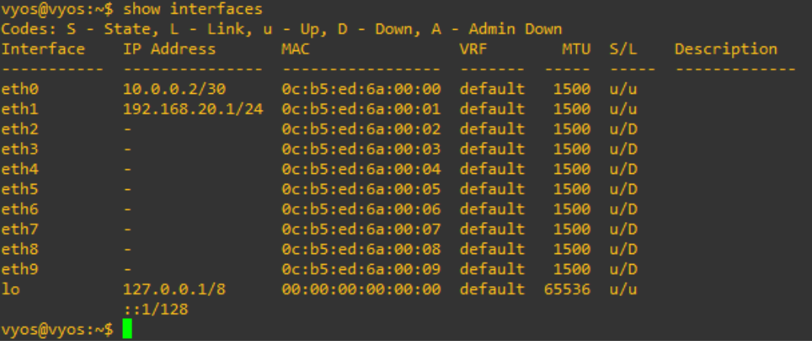
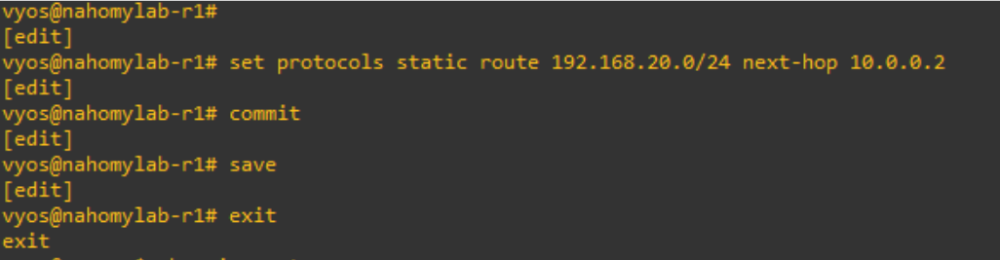
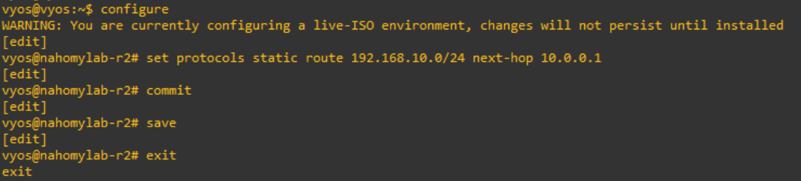
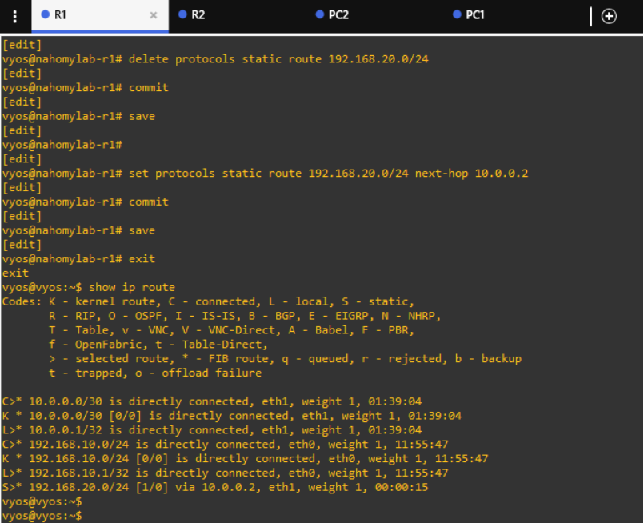
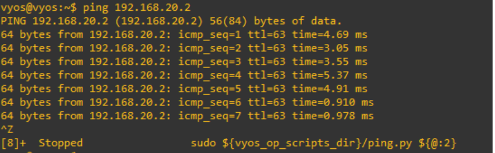
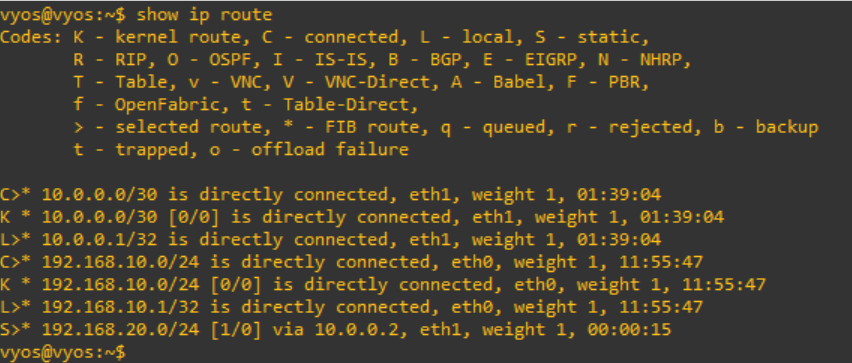
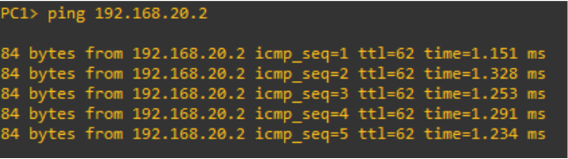

#  Lab 01: Static Routing Between Two VyOS Routers

##  Objective  

Establish Layer 3 connectivity between two end-host PCs using two VyOS routers in GNS3 by implementing static routing.  
This lab reinforces:

- IP addressing and subnetting
- Interface assignment and verification
- Static route configuration
- Troubleshooting unreachable networks
- End-to-end connectivity testing

---

##  Lab Topology



Devices:
- R1 and R2: VyOS routers (qcow2 image in GNS3)
- PC1 and PC2: Virtual end-hosts in GNS3
- All devices run on a single canvas in GNS3 using VMware backend



---

##  Configuration Summary

### ▶️ R1 Configuration

```
set interfaces ethernet eth0 address 192.168.10.1/24
set interfaces ethernet eth1 address 10.0.0.1/30
```


### ▶️ R2 Configuration

```
set interfaces ethernet eth0 address 10.0.0.2/30
set interfaces ethernet eth1 address 192.168.20.1/24
```



###  PC Host Configuration

#### 💻 PC1

- IP: 192.168.10.2
- Subnet: 255.255.255.0
- Gateway: 192.168.10.1

#### 💻 PC2

- IP: 192.168.20.2  
- Subnet: 255.255.255.0  
- Gateway: 192.168.20.1


##  Static Routing Configuration

#### ▶️ R1

```
set protocols static route 192.168.20.0/24 next-hop 10.0.0.2
```


#### ▶️ R2

```
set protocols static route 192.168.10.0/24 next-hop 10.0.0.1
```


---

##  Troubleshooting Highlights:

- Initial route not showing in R1’s routing table
- Verified R1–R2 link with ping 10.0.0.2
- Checked interface status with show interfaces
- Route config confirmed with: show configuration commands | match static
- Flushed and reapplied static route using:

```
delete protocols static route 192.168.20.0/24
commit
set protocols static route 192.168.20.0/24 next-hop 10.0.0.2
```


---

##  Verification Results

### ping 10.0.0.2 from R1: ✅ Success



### Routing Table Output (R1):

S>* 192.168.20.0/24 [1/0] via 10.0.0.2, eth1


### ping 192.168.20.2 from PC1: ✅ Success



---

##  Concepts Reinforced

- Subnetting with /24 and /30 masks
- Static routing behavior in VyOS
- Next-hop resolution and routing table population
- Interface verification and troubleshooting
- Hands-on NOC-style diagnostics and fixes

---

### Lab Status: SUCCESS ✅ End-to-end L3 connectivity established between PC1 and PC2 via two VyOS routers.


